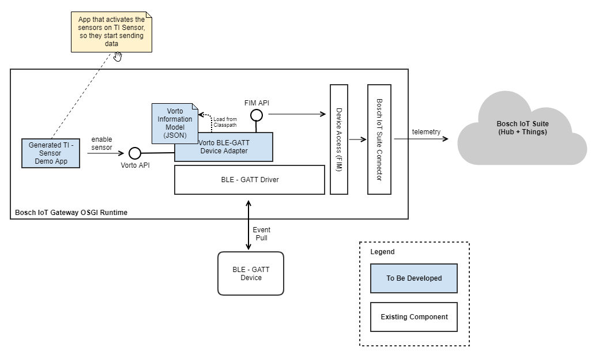
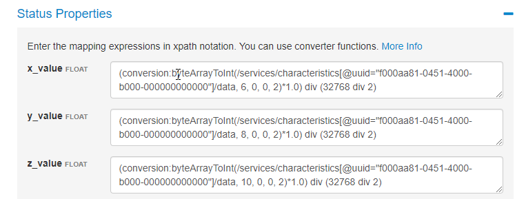

# Connect a BLE-GATT Device with the Bosch IoT Gateway Software

The objective of this tutorial is to show how to connect a BLE-GATT Device to the Bosch IoT Gateway Software by using Vorto, with its code generation and payload mapping capability. We will be using a BLE device (TISensorTag) as an example.

This is the architecture that we are implementing:



The idea is to drive the discovery and retrieval of data from the device with Vorto Mappings and use the device's Vorto model as the structure of the device's data. A functional item can then be instantiated based on the discovered devices and their values. Furthermore, some thoughts on data harmonization and how to achieve it is given as an added extra.

# Prerequisites:

  - [Installation](http://documentation.bosch-si.com/iot/SDK/v9/en/index.htm#getting_started_quickstart.htm) of the IoT Gateway Software SDK on development machine
  - A [running IoT Gateway](http://documentation.bosch-si.com/iot/SDK/v9/en/index.htm#76133.htm) that's already [provisioned and connected](https://docs.bosch-iot-suite.com/asset-communication/Connect-gateways-running-Bosch-IoT-Gateway-Software.html)
  - A TISensorTag paired to the running IoT gateway
  - A [Suite for Asset Communication subscription](https://accounts.bosch-iot-suite.com/subscriptions/)

# Create the Information Model
  - Create the [TISensorTag information model](https://github.com/eclipse/vorto/blob/development/docs/tutorials/describe_tisensor.md)

# Create a Mapping Specification

The [Payload Mapping Specification](https://github.com/eclipse/vorto/blob/development/mapping-engine/Readme.md) tutorial outlines the steps needed to create a mapping specification and use it. This will cover the mapping of the payload (the conversion of the actual data from the device to functionblock values). Another aspect of mapping is device discovery and protocol which we will discuss after. An example is given below on how to map the accelerometer values from the TISensorTag. The rest is left as an exercise to the reader.

### How to map accelerometer values using the mapping specification

We can map the accelerometer values by the following mapping code:

**x_value**
```javascript
(conversion:byteArrayToInt(/services/characteristics[@uuid="f000aa81-0451-4000-b000-000000000000"]/data, 6, 0, 0, 2)*1.0) div (32768 div 2)
```
**y_value**
```javascript
(conversion:byteArrayToInt(/services/characteristics[@uuid="f000aa81-0451-4000-b000-000000000000"]/data, 8, 0, 0, 2)*1.0) div (32768 div 2)
```
**z_value**
```javascript
(conversion:byteArrayToInt(/services/characteristics[@uuid="f000aa81-0451-4000-b000-000000000000"]/data, 10, 0, 0, 2)*1.0) div (32768 div 2)
```

Here's how it would look like in Vorto:



### Adding metadata for discovery and protocol

To drive the discovery and retrieval of data, we will need to add additional stereotypes to the mapping.

Mapping stereotypes are technology or platform specific information that can be used to enrich a Vorto information model. For BLE-GATT, we will need to add this additional mapping stereotypes to the mapping specification so we can drive device discovery and data retrieval:
- **DeviceProfile** - This stereotype on the information model will allow the identification of TI Sensor Tag devices
    ```
    from TISensorTag to DeviceProfile with { modelNumberString : "CC2650 SensorTag" }
    ```
- **GattService** - This stereotype on the function block will allow the mapping of a function block to a specific GATT Service
    ```
    from Accelerometer to GattService with {uuid:"f000aa80-0451-4000-b000-000000000000"}
    ```
- **OnConnect** - This stereotype on the function block will allow us to execute any handshake before the retrieval of data. Some BLE devices require that we send certain values to specific services before we can retrieve data.
    ```
    from Accelerometer to OnConnect with {value:"FE00", uuid:"f000aa82-0451-4000-b000-000000000000", enable: "true"}
    ```

You can download the entire TISensorTag information model including mappings from [here]().
> The mapping specification only contains mapping for the accelerometer. The rest is left as an exercise to the reader

After the creation of the information model, the mapping specification, and the BLE-GATT specific mapping stereotypes, we can now [download the entire mapping specification](https://github.com/eclipse/vorto/tree/development/mapping-engine#step-3-download--execute-mapping-specification) and use it to produce the device adapter.

# Generate code for Bosch IoT Suite Gateway

After downloading the mapping spec that we created, now we need to invoke the generator to generate an OSGI bundle with the application skeleton that we need.

Go to the Vorto repository, look for your model, and open it. On the right hand side, you should see several generators, click on the FIM generator.

<< screenshot here >>

The generated code is an OSGI bundle. Open it as an eclipse project in your Eclipse IDE where you installed the IoT Gateway Software Development SDK.

## Code Walkthrough

The bundle consist of an **Activator** and the generated [Functional Item](http://documentation.bosch-si.com/iot/SDK/v9/en/index.htm#80780.htm) declaration and implementation class. The main logic consist of the discovery of devices, and the creation of a functional item of that device if it doesn't yet exist. To retrieve data, a **Device Adapter** is handed over to the functional item implementation, which handles the extraction of data using the **Device Adapter API**.

### Device Adapter API

The Device Adapter API we are using is adapted from [Vorto's Device Adapter API](https://github.com/eclipse/vorto/tree/development/device-adapter/device-adapter-api). It contains the essential APIs to allow discovery and retrieving of data from a device

**IDeviceAdapter.java**
```java
void listAvailableDevicesAsync(int scantimeInMs, IDeviceDiscoveryCallback discoveryCallbackHandler);

InfomodelValue receive(String deviceId);

FunctionblockValue receive(String infomodelProperty, String deviceId);
```

To instantiate it, we give its factory a mapping specification, and it would return a Device Adapter whose behaviour is entirely driven by that mapping specification.

**IVortoDeviceAdapters.java**
```java
IDeviceAdapter getAdapter(String mappingSpec);
```

This factory is then exposed as an OSGI service which you can retrieve following the next section.

### The Device Adapter OSGI service
The Device Adapter OSGI Service Bundle with implementations for BLE-GATT can be downloaded [here]() and cloned from [here]().

The OSGI service (*IVortoDeviceAdapters*) is a factory that when giving a mapping specification with stereotypes for BLE-GATT, will return a Device Adapter (*IDeviceAdapter*) that can do discovery and retrieve information model and function block values from a BLE device.

### Retrieving the Device Adapter OSGI service
The Device Adapter can be instantiated by retrieving the OSGI service for its factory. This can be done in many ways.

**By directly retrieving it from the Bundle Context:**
```java
IVortoDeviceAdapters deviceAdapters = context.getService(context.getServiceReference(IVortoDeviceAdapters.class))
```
**By using a service tracker**
```java
deviceAdapterTracker = new ServiceTracker<IVortoDeviceAdapters, IVortoDeviceAdapters>(context, IVortoDeviceAdapters.class, null);
IVortoDeviceAdapters deviceAdapters = deviceAdapterTracker.getService();
```

### Instantiating a Device Adapter

After the factory service has been retrieved, you can now create a device adapter by using its factory method, passing in a [mapping specification you have downloaded](https://github.com/eclipse/vorto/tree/development/mapping-engine#step-3-download--execute-mapping-specification).

```java
IDeviceAdapter deviceAdapter = deviceAdapters.getAdapter(mappingSpec);
```

## Deploying and Running the Generated Bundle

### Prerequisites to deployment
Before you can deploy and run the bundle though, you need to download the Vorto Device Adapter Bundle for BLE-GATT first [here]() or clone it and build it yourself [here](). You will also need to [download]() the Cloud Service Provider bundle which we will discuss some other time. Now, deploy both bundles to your IoT Gateway.

### Configuration of the Bundle
To configure the bundle, you will need to replace the values in the Activator for NAMESPACE and TENANT with the values that you provisioned your gateway with. You also need to download your mapping specification file and put it on the root of the bundle and specify the name in MAPPING_SPEC.

Afterwards, you can now deploy your bundle.

### Testing BLE Connectivity via the Web Console
Now you can go to your IoT Gateway's Web Console, to the FIM console and check if a functional item for your TISensorTag is there. The UID should be ***vorto::<DEVICE ID OF TISENSORTAG>::TISensorTag***.

### Testing via Things Dashboard
If you have a connected gateway, you can check in the Things Dashboard if your device is a feature of the gateway. It should contain accelerometer readings from your sensor.

# What's next ?

## Adding Cloud (Bosch IoT Suite) connectivity for device
Although now we see the sensor values of our device as a feature in the gateway, it is far from beautiful. The next step is what we call data harmonization. This [blog post](https://blog.bosch-si.com/developer/harmonizing-specific-device-payloads-using-eclipse-vorto/) addresses why device data harmonization is useful.

In order to harmonize your data, we must first provision our device, and then install a Cloud Service Provider.

## Provisioning your device

To provision your device, we follow the same steps that you did for provisioning the gateway, except that this time you use the bluetooth address (e.g _B0:B4:48:B9:88:80_) of the device as the device id. The steps are detailed [here](https://docs.bosch-iot-suite.com/asset-communication/Device-provisioning.html). Don't forget to make your provisioned device [accessible](https://docs.bosch-iot-suite.com/asset-communication/Make-things-accessible-for-the-Things-dashboard.html) in the Things Dashboard.

## Installing the Vorto Cloud Service Provider

You can download the Vorto Cloud Service Provider from [here]() or clone it from [here]() and build it yourself.

This OSGI bundle provides an **ICloudServiceProvider** service which acts as the factory for the **ICloudService**.

This particular service is already being used by the bundle that you generated above. Essentially, it allows you to send a function block value or an information model value to the Bosch IoT Suite, to a device that you provisioned yourself, with harmonized payload.

## Check the harmonized data in the Things Dashboard

Now you can go to your Things Dashboard and see your device containing harmonized sensor data.

